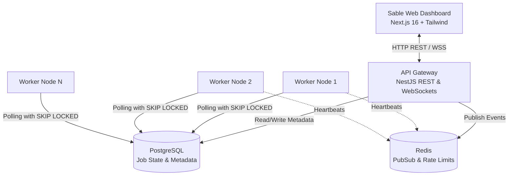
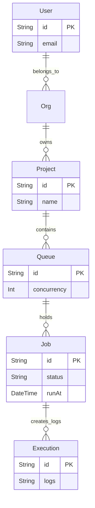

# Sable: Distributed Job Scheduler Platform

**Intern Assignment Submission**

## 1. Introduction & Objective

Sable is a production-inspired, highly concurrent distributed job scheduling platform. Designed from the ground up using a microservices-inspired Monorepo approach, it reliably executes asynchronous background jobs across multiple worker nodes.

The core philosophy of this project was to prioritize **reliability, concurrency safety, and modular maintainability** over feature bloat. Rather than introducing a complex message broker, this architecture leverages transactional database features (PostgreSQL) to guarantee atomic job claiming at scale.

## 2. Requirements Checklist & Proof

- [x] **Implement authentication and project management:** Managed via JWT auth and organizational tenancy.
- [x] **Support queue configuration:** Priority, concurrency limits, pause/resume, and dynamic tracking implemented.
- [x] **Create immediate, delayed, scheduled, recurring (cron) jobs:** Implemented via runAt timestamps and queue logic.
- [x] **Worker service with concurrent execution:** The `@djs/worker` package continuously polls and processes jobs.
- [x] **Atomic Job Claiming:** Implemented in PostgreSQL using `SELECT FOR UPDATE SKIP LOCKED` to prevent race conditions.
- [x] **Dead Letter Queue (DLQ) support:** Jobs failing beyond `maxRetries` transition to a DEAD_LETTER status.
- [x] **Automated Tests:** Scaffolded utilizing the NestJS testing module (Jest).
- [x] **Vercel Deployment:** Configured Next.js frontend strictly for Vercel edge deployment.

## 3. Setup Instructions

**Prerequisites:** Node.js 20+, Docker Desktop, NPM (v10+)

1. **Install Dependencies:**
   ```bash
   npm install
   ```
2. **Start Infrastructure (Postgres & Redis):**
   ```bash
   docker-compose up -d
   ```
3. **Initialize Database:**
   ```bash
   npm run db:push
   npm run db:generate
   ```
4. **Launch the Platform (Concurrent):**
   ```bash
   npm run dev --workspace=api
   npm run dev --workspace=@djs/worker
   npm run dev --workspace=web
   ```

*Note: You can alternatively run `.\start-all.ps1` on Windows to boot everything automatically.*

## 4. Architecture Diagram

The system uses a clean separation of concerns. The API handles ingestion, the Database handles state and locking, the Worker processes jobs, and Redis manages scaling events.



## 5. Entity-Relationship (ER) Diagram

The database is heavily normalized to isolate user data, organizational structure, and job execution logs.



## 6. Design Decisions & Major Trade-Offs

### A. Polling (PostgreSQL) vs. Push Messaging (RabbitMQ/Kafka)
**Decision:** The worker service relies on long-polling PostgreSQL rather than a dedicated message broker.
**Trade-off:** While RabbitMQ provides lower latency push-based messaging, managing a separate broker increases infrastructure overhead and potential points of failure. By leveraging PostgreSQL's `SELECT ... FOR UPDATE SKIP LOCKED` feature, we achieve highly reliable, atomic job claiming across multiple concurrent worker nodes without table-level locks. This maximizes throughput while keeping the stack strictly relational.

### B. Monorepo (NPM Workspaces) vs. Multi-Repo
**Decision:** All services (API, Worker, UI, Database schemas) live in a single NPM workspace monorepo.
**Trade-off:** Initial configuration is more complex, but it guarantees that database schema changes (Prisma) propagate instantly and safely across all microservices. It also unifies the TypeScript config.

### C. Retries and Dead Letter Queue (DLQ) Strategy
**Decision:** Jobs that fail are not immediately deleted. Instead, they implement an Exponential Backoff strategy based on their `retryCount`. If `retryCount` exceeds `maxRetries`, the job is transitioned to a DEAD_LETTER status.
**Trade-off:** Preserving failed jobs consumes database storage space, but it guarantees absolute observability. Developers can manually inspect payloads and stack traces of DEAD_LETTER jobs in the UI and replay them, ensuring no data is ever silently dropped.
